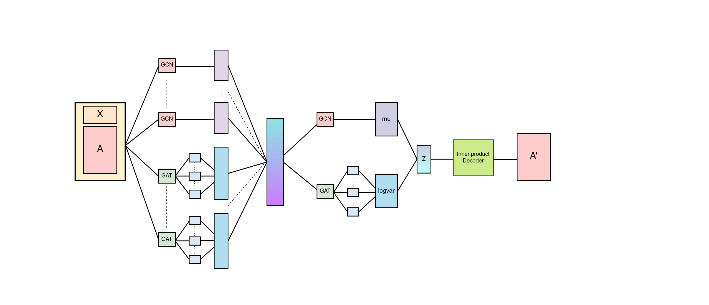

<h1 align="center">MultiHead VGAEs</h1>

<h4 align="center">  
  
[](https://github.com/trekhleb/state-of-the-art-shitcode)
[](https://github.com/trekhleb/state-of-the-art-shitcode)
[](https://github.com/trekhleb/state-of-the-art-shitcode)
  
</h4>

<p align="center">
  
</p>

## Abstract
<p align="justify">
Graphs are very much useful when it comes for link prediction tasks and for those, we need to have a very good embedding method that could transform the high dimensional node features to a single vector representation. Several methods have been proposed for different kinds of Variation Graph Autoencoders architecture. Each and every new architecture brings some kind of variations and acceleration in performance either in computational speed or getting good results. Our method is a combination of both. This architecture surpasses the link predictions metrics for all the three benchmark datasets. Along with the parallel auto-encoders could undergo parallel computation for faster and accurate results at the same time. Our method proposes a novel encoder architectures that consist of parallel branching of different encoder blocks a combination of GCN and GATConv encoders and from those blocks we take the maximum sampled out node embeddings, and thus can achieve some competitive results on the three benchmark datasets for link prediction tasks
</p>

## Requirements
```
1. python3
2. pytorch == 1.10.1
3. torch_geometric
4. scipy
5. numpy
6. wandb
```
## Installation 


#### **With CUDA**

**Note: Check whether the cuda version is either 10.2 or 11.3, PyG does't work properly for cuda version 11.1**

If you are having cuda available, then we can just install these packages from our terminal as mentioned below.

Install PyTorch

for cuda: 10.2
```
$ pip3 install torch torchvision torchaudio
```
for cuda 11.3
```
$ pip3 install torch==1.10.1+cu113 torchvision==0.11.2+cu113 torchaudio==0.10.1+cu113 -f https://download.pytorch.org/whl/cu113/torch_stable.html
```

Or install PyTorch using conda
(for cuda 10.2)

```
$ conda install pytorch torchvision torchaudio cudatoolkit=10.2 -c pytorch
```
(for cuda 11.3)
```
$ conda install pytorch torchvision torchaudio cudatoolkit=11.3 -c pytorch
```
#

Install pytorch geometric packages (using pip)

 Please note that change the version of torch and cuda in the installation based on your current version. An example is shown below:

```
$ pip install -q torch-scatter -f https://data.pyg.org/whl/torch-{TORCH VERSION}+{CUDA VERSION}.html
```
So based on this, install these packages, currently default is been set to torch version `1.10.0` and cuda version `cu113`

```shell
$ pip install -q torch-scatter -f https://data.pyg.org/whl/torch-1.10.0+cu113.html

$ pip install -q torch-sparse -f https://data.pyg.org/whl/torch-1.10.0+cu113.html

$ pip install -q git+https://github.com/pyg-team/pytorch_geometric.git
```

Or, Install pytorch geometric using conda.

```
$ conda install pyg -c pyg -c conda-forge
```
#

**Without CUDA:**
If you are using CPU, which is absolutely fine, then just install pytorch, pytorch_geometric for cpu by following this commands. Installation process could be appear easier if done using anaconda.

Install PyTorch

(using pip)
```
pip3 install torch==1.10.1+cpu torchvision==0.11.2+cpu torchaudio==0.10.1+cpu -f https://download.pytorch.org/whl/cpu/torch_stable.html
```

(using conda)
```
conda install pytorch torchvision torchaudio cpuonly -c pytorch
```

Install PyTorch Geometric (CPU) using pip
```
pip install torch-scatter torch-sparse torch-cluster torch-spline-conv torch-geometric -f https://data.pyg.org/whl/torch-1.10.0+cpu.html
```

Install PyTorch Geometric (CPU) using conda **recommended**

```shell
conda install pyg -c pyg -c conda-forge
```

For further installation procedure, please go through the [Official PyTorch Documentation](https://pytorch.org/) and [official PyG documentation](https://pytorch-geometric.readthedocs.io/en/latest/notes/installation.html)


Install wandb
```
pip install wandb
```
<br> </br>

## Running the model 

There are different parameters which can be tweaked up and we can run the models with different configarations and datasets and also integrate with wandb to visualize results.

| Command | Description |
| --- | --- |
| --model | The VGAE model for training the benchmark datasets (base_model is the official benchmark model |
| --hidden_dim1 | The number of first hidden layer of autoencoder which is 32 by default |
| --hidden_dim2 | The number of second hidden layer of autoencoder (for mu, logvar) which is 16 by default |
| --dataset | Choose the Bench mark datasets, available datasets: cora, citeseer, pubmed |
| --lr | Choose a learning rate, default: 0.01 best lr: 0.015375 |
| --optimizer | Choose the optimizer, available optimizers: adam, adamw, rms-prop, sgd |
| --epochs | The number of epochs for the model to train, default: 200 |
| --num_heads | (optional) The numeber of attention heads required for the model architecture, use only when there is an attenion block included. |
| --heads | Combination of Heads that will be used in Multihead VGAE models when required eg: gcn-gat-gcn-gat |
| --wandb_project_name | (optional) Only use when you want to log and visualize the metrics on weights and biases (wandb) |


### Runnning the base model

To run the base model (the actual VGAE model) just type this:

```
python3 main.py 
```
This will generate an output similar to like this:

<p align="center">
  
</p>


### Running the model with custom configurations
Suppose we wanna run our model with these custom configurations:
```
1. model : multi_head_gcn_gat_merge
2. dataset: pubmed
3. epochs: 250
4. lr: 0.015375
5. heads: gcn-gat
6. num_heads: 4
```
```
python3 main.py --dataset pubmed --model multi_head_gcn_gat_merge --epochs 250 --lr 0.015375 --heads gcn-gat --num_heads 4
```

<p align="center">
  
</p>


If we wanna also log and visualize the training and testing metrics per epochs, then we can do that by just adding the `-wandb_project_name` arg, similar to this.

```
python3 main.py --wandb_project_name test_project
```
This will show this kind of output in terminal as shown below and in the wandb website. One thing, we have to have an existing account in wandb.

<p align="center">
  
</p>

<p align="center">
  
</p>

If you we the wandb logs carefully, then the names of the model are automatically made according the args we had typed in the treminal. Also we can track everything from test ROC. AUC scores to the time taken per epochs, disc utilizations etc.

## Comparision with benchmarks
Here we have taken the same model configurations as mentioned in the official paper of VGAE. As there are some other hyper-parameters specific to our model, as we can design the heads of different and multiple blocks of those. Also we can choose the number of attention heads if we include a `GATConv` block in one of the head. But here we choose to take the bare minimum configurations.

```
1. Hidden dim 1 : 32
2. Hidden dim 2 : 16
3. Epochs       : 200
4. lr           : 0.01
5. Heads : [GCNConv, GATConv]
6. Number of Attention Heads: 2
```

Here are the results and comparision with our model.

**Have to change the values (tentaive)**

| Model | Dataset | ROC-AUC score | AP score
| --- | --- | --- | --- |
| VGAE | Cora | 91.4 | 92.6 |
| **MultiHead VGAEs** | **Cora** | **97.28** | **97.11** |


| Model | Dataset | ROC-AUC score | AP score
| --- | --- | --- | --- |
| VGAE | Citeseer | 90.08 | 92.0 |
| **MultiHead VGAEs** | **Citeseer** | **95.68** | **95.31** |


| Model | Dataset | ROC-AUC score | AP score
| --- | --- | --- | --- |
| VGAE | Pubmed | 94.4 | 94.7 |
| **MultiHead VGAEs** | **Pubmed** | **98.18** | **97.88** |

If you want to visualize the results of the runs, please go to this [link](https://wandb.ai/anindya/BaseTestsResults?workspace=user-anindya)

<br> </br>
## Comparision with the best model so far.
We did't stopped here. Those runs were done with the bare minimum configurations of the model. But those can be extended by using some optimal configurations. And we are glad to share that we have surpassed the results of other models in terms of all the metrics and time required to run the model.

For surpassing the performence of the state of the artmodels, we have applied these config for training our model:
```
Model : MultiHead VGAE 
Heads : GCN, GAT Conv
Number of attention heads: 4
epochs: 300
lr: 0.015375
Hidden dim1: 64
Hidden dim1: 32
```

| Model | Dataset | ROC-AUC score | AP score
| --- | --- | --- | --- |
| VGAE | Cora | 91.4 | 92.6 |
| GNAE | Cora | 95.6 | 95.7 |
| Walkpooling | Cora | 95.9 | 96.0 |
| **MultiHead VGAEs** | **Cora** | **99.13** | **99.2** |


| Model | Dataset | ROC-AUC score | AP score
| --- | --- | --- | --- |
| VGNAE | Citeseer | 97.0 | 97.1 |
| Graph InfoClust | Citeseer | 97.0 | 96.8 |
| **MultiHead VGAEs** | **Citeseer** | **98.56** | **98.37** |


| Model | Dataset | ROC-AUC score | AP score
| --- | --- | --- | --- |
| VGAE | Pubmed | 94.4 | 94.7 |
| VGNAE | Pubmed | 97.6 | 97.6 |
| Walkpooling | Pubmed | 98.7 | 98.7 |
| **MultiHead VGAEs** | **Pubmed** | **99.18** | **98.91** |


Also view our best model runs [here](https://wandb.ai/anindya/FinalBenchmarkTests?workspace=user-anindya)

```
@misc{anindyadeep2022link,
    title={Link Prediction with MultiHead GCN-GAT},
    author={Anindyadeep Sannigrahi, Rahee Walambe, Yashovardhan, Yashowardhan Shinde},
    year={2022},
    archivePrefix={arXiv},
}
```
